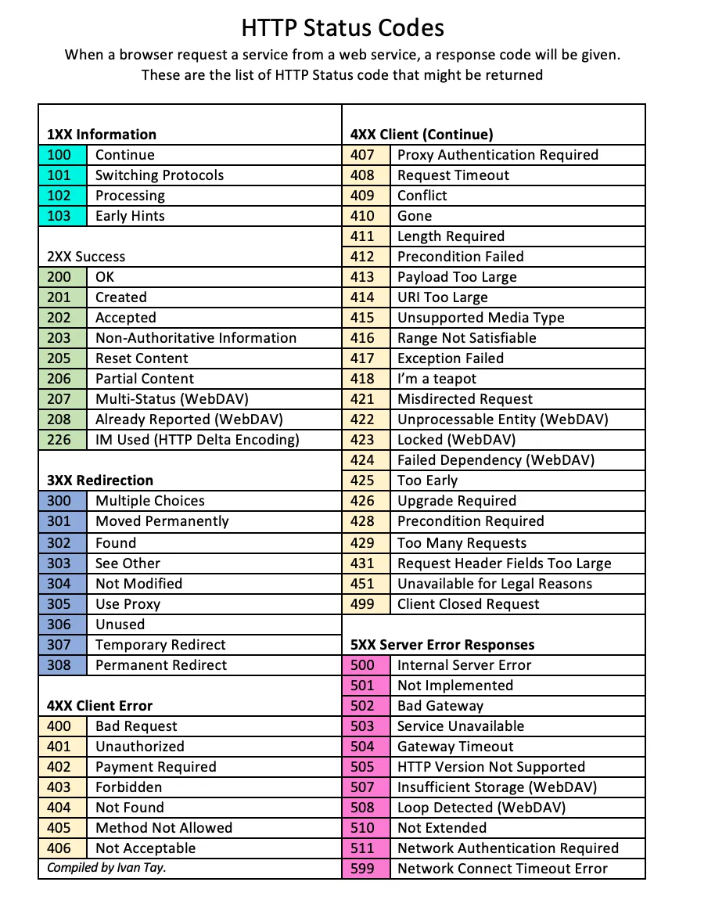
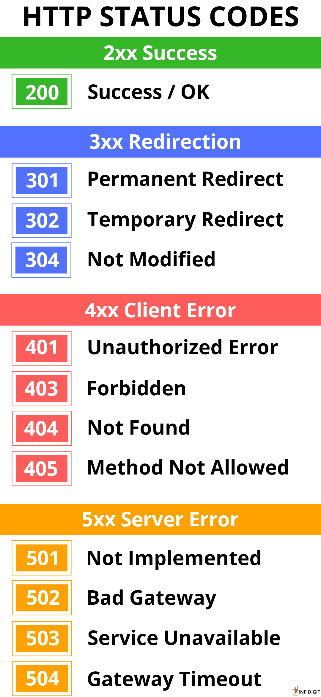

# Sección 1 - Curso de Python FastAPI

## 0 FastAPI
* [Documentación oficial](https://fastapi.tiangolo.com/)

## 1.1 - Crear entorno virtual = env
* Crear env: `python -m venv ./env/env1`
* Activar env linux: `source env/env1/bin/activate`
* Activar env windows: `./env/env1/Scripts/activate`
* [Documentación oficial](https://docs.python.org/es/3/library/venv.html)
* Revisar que esté instalado: `pip list`
* Revisar version de python: `python -V`
* Actualizar pip: `python.exe -m pip install --upgrade pip`

## 1.2 - Instalar dependencias
* Instalar FastAPI: `pip install fastapi`
* Instalar sevidor = Uvicorn: `pip install uvicorn`
* Instalar dependencias: `pip install -r requirements.txt`
* Crear archivo requirements.txt: `pip freeze > requirements.txt`
* Revisar dependencias: `pip freeze`

## 1.3 - Crear servidor
* Crear servidor: `uvicorn main:app --reload`
* Crear servidor con puerto: `uvicorn main:app --reload --port 8000`
* Crear servidor con nombre y host: `uvicorn main:app --reload --port 8000 --host 0.0.0.0`

## 1.4 - Instalar dependencia Jinja2
* Instalar dependencia: `pip install jinja2`
* descripción: `Jinja2 es un motor de plantillas para Python. Es rápido, ampliamente utilizado y seguro.`
* [Documentación oficial](https://pypi.org/project/Jinja2/)

## 1.5 - Instalar dependencia SQLAlchemy
* Instalar dependencia: `pip install sqlalchemy`
* descripción: `SQLAlchemy es un kit de herramientas SQL para Python.`
* [Documentación oficial](https://www.sqlalchemy.org/)


* [Documentación oficial](https://pypi.org/project/autopep8/)

## 1.7 - Instalar dependencia pydantic
* Instalar dependencia: `pip install pydantic`
* descripción: `Pydantic es una librería para validar datos en Python.`
* [Documentación Validaciones](https://docs.pydantic.dev/latest/concepts/validators/) 
* [Documentación Tipos de datos](https://docs.pydantic.dev/1.10/usage/types/#pydantic-types)
* Instalar validacion de email: `pip install pydantic[email]`

## 1.8 - Instalar dependencia python-dotenv
* Instalar dependencia: `pip install python-dotenv`
* descripción: `python-dotenv lee variables de entorno desde archivos .env.`
* [Documentación oficial](https://pypi.org/project/python-dotenv/)

## 1.9 - Instalar dependencia python-multipart
* Instalar dependencia: `pip install python-multipart`
* descripción: `python-multipart es una librería para manejar datos multipart en Python.`
* [Documentación oficial](https://pypi.org/project/python-multipart/)
* [Documentación Uploadfile](https://fastapi.tiangolo.com/reference/uploadfile/)

## 1.10 - Instalar dependencia fastapi-mail
* Instalar dependencia: ```pip install fastapi-mail```
* descripción: es una librería para el envió de correos
* [Documentación](https://sabuhish.github.io/fastapi-mail/example/)

# 2.0 Base de datos
* Cada base de datos requiere un conector que se debe instalar de forma independiente. Luego configurar la conexión con esa base de datos.

## 2.1 instalar dependencia sqlalchemy
* instalar dependencia: ```pip install sqlalchemy```
* [Documentación Instalación](https://docs.sqlalchemy.org/en/20/intro.html#installation)
* [Documentación Guía](https://docs.sqlalchemy.org/en/20/orm/quickstart.html)

## 2.2 instalar dependencia  para base de datos
#### 2.2.1 BD Postgre SQL
* instalar dependencia: ```pip install psycopg2 ```
* [Documentación](https://www.psycopg.org/docs/install.html#quick-install)

#### 2.2.1 BD MySQL conector
* instalar dependencia: ```pip install mysql-conector-python ```

## 2.3 Hasheo de contraseña 
* Instalar dependencia: ```pip install passlib[bcrypt]```
* [Docuementación passlib](https://passlib.readthedocs.io/en/stable/)
* [Docuementación ](https://fastapi.tiangolo.com/tutorial/security/oauth2-jwt/#install-passlib)

### Lista de errores HTTP


